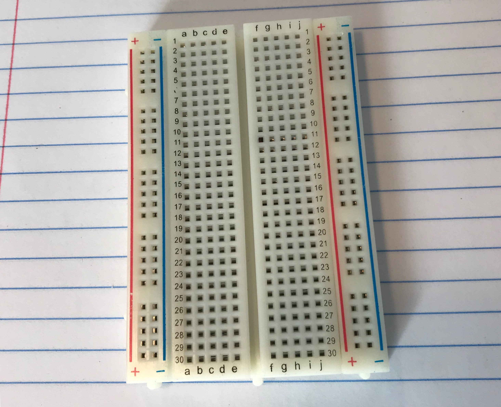

# Buy equipment

[`^` Table of Contents](../howto.md)

Before I could start connecting things to things, I needed things. I made a shopping list of parts
to order (which I understand in electronics is called a [bill of
materials](https://en.wikipedia.org/wiki/Bill_of_materials)).

* [Record player](#record-player)
* [Records](#records)
* Computing hardware
  * [Raspberry Pi](#raspberry-pi)
  * [MicroSD card](#microsd-card)
  * [Various cables and peripherals](#various-cables-and-peripherals)
* I/O hardware
  * [Keypad](#keypad)
  * [Display](#display)
* Electronics supplies
  * [Breadboard](#breadboard)
  * [Jumper wires](#jumper-wires)
  * [Multimeter](#multimeter)

## Record player

I found a record player on Facebook Marketplace. I drove out to the suburbs to pick it up. The
seller's house had an huge American flag in front, a meticulously tended garden, and  SUV and an
F-150 parked in the driveway. I was like "Ah. Republicans." And when I went up to the front door,
sure enough, they had Fox News on the TV.

Anyway, the record player I got is a Fisher MT-6420. It's very cheap. **I recommend getting a
cheap record player for your first time through this project.** Don't waste a nice one until you
know exactly what you're doing. We won't be using the sound output, so it doesn't need to sound
nice: it just needs to not scratch your records.

Beyond cost, a cheap record player usually has the benefit of simplicity. We're going to open the
thing up and figure out how its circuits work, so we don't want a lot of bells and whistles. They'll
just confuse us.

## Records

I bought a few records at my local DIY concert venue, [ng2bc](https://www.instagram.com/ng2bc/).

It doesn't matter what records you buy, as long as they're not scratched. The sound that comes out
of the DRP will be coming from the Raspberry Pi, not the needle. Just buy records with sleeves you
like.

## Computing hardware

The main piece of computing hardware I needed was a Raspberry Pi. I also needed some peripherals for
it.

You could probably do this project with an Arduino and some combination of shields, but I know Linux
and Python pretty well, so I decided it would be easier to use a Raspberry Pi.

### Raspberry Pi

The Raspberry Pi is a tiny computer that runs Linux. You can buy one on the [Raspberry Pi
Store](https://www.raspberrypi.org/products/). This guide won't go into detail on installing Linux
or getting the Raspberry Pi to connect to a network. Those things are well covered by the [Raspberry
Pi documentation](https://www.raspberrypi.org/documentation/)

If you don't have one already, you might as well get the most recent model. I happened to have a Pi
2 Model B lying around, so I used that. The only thing you need to be wary of is that some of the
_very_ early Pi models had only 24 [GPIO
pins](https://www.raspberrypi.org/documentation/usage/gpio/), whereas the more recent models
have 40. You'll need a lot of pins for this project.

### MicroSD card

Just about any modern MicroSD card will work with the latest model of Raspberry Pi, but you can find
guidelines [here](https://www.raspberrypi.org/documentation/installation/sd-cards.md).

In terms of size, you'll want about 100 MB per album you want to load onto the thing, after
allotting about 2.5 GB for the operating system. For example, I used a 32 GB MicroSD card, so I have
room for about

    [(32 GB) - (2.5 GB)] / (100 MB) = 295 albums

In order to load data onto the MicroSD card, you'll need some way to connect your computer to it.
Many computers have a built-in (non-Micro-)SD card slot. If you have one of these, then you should
be all set: your MicroSD card will likely come with an non-micro-to-micro adapter.

In my case, since I have one of the newer MacBooks with only USB-C ports (🙄), I needed a dongle. I
ordered [one made by Anker](https://www.amazon.com/gp/product/B07B9PJ7FQ/).

### Various cables and peripherals

I needed to be able to talk to the Raspberry Pi in order to deploy code and troubleshoot. This can
be done with a (USB) keyboard and (HDMI) monitor. I'm more comfortable doing this stuff over SSH, so
I also needed an Ethernet cable and an Ethernet adapter.

## I/O hardware

The user experience of the Digital Record Player involves typing some numbers on a keypad and
reading some output on an LCD. So I needed a keypand and an LCD.

### Keypad

Since this was my first time doing an electronics project, I went with what's sort of a "beginner's
keypad": Adafruit's [3x4 Phone-style Matrix Keypad](https://www.adafruit.com/product/1824).

One nice thing about the Adafruit keypads is that Adafruit publishes a [library and
tutorial](https://learn.adafruit.com/matrix-keypad/python-circuitpython#python-computer-wiring-2-3)
for connecting them to a Raspberry Pi.

### Display

The LCD I bought is Adafruit's [Standard LCD 16x2](https://www.adafruit.com/product/181). Something
simpler, like the [4-Digit 7-Segment Display](https://www.adafruit.com/product/878) would also have
worked, since the Digital Record Player only _really_ needs to display 4 digits at a time.

One of the advantages of the stardard LCD over the 7-segment display is that the former has a
[tutorial](https://learn.adafruit.com/drive-a-16x2-lcd-directly-with-a-raspberry-pi/overview).

## Electronics supplies

Once I had all these components, I needed to connect them to each other. For this, I needed jumper
wires, a multimeter, and a breadboard.

### Breadboard and jumper wires

When you're drawing a picture, it's best to draw in pencil first. Once you're happy with your pencil
sketch, you can trace over it in pen.

Soldering is like drawing in pen: it's advisable to figure out your circuit "in pencil" with jumper
cables and a breadboard before you commit. So I ordered the following from Adafruit:

* [Half-size breadboard](https://www.adafruit.com/product/64)
* [Female/Male 'Extension' Jumper Wires](https://www.adafruit.com/product/1954)
* [Female/Female Jumper Wires](https://www.adafruit.com/product/266)

Female/male wires can be used to connect the GPIO pins on the Raspberry Pi, keypad header, and LCD
header, to the breadboard.  Female/female wires can be used to connect GPIO pins directly to other
GPIO pins. It's a good idea to have both types.

### Multimeter

I needed to figure out what was happening in the record player's circuits. A multimeter is a tool
that lets you measure voltage and resistance in circuits. I had this one lying around:

